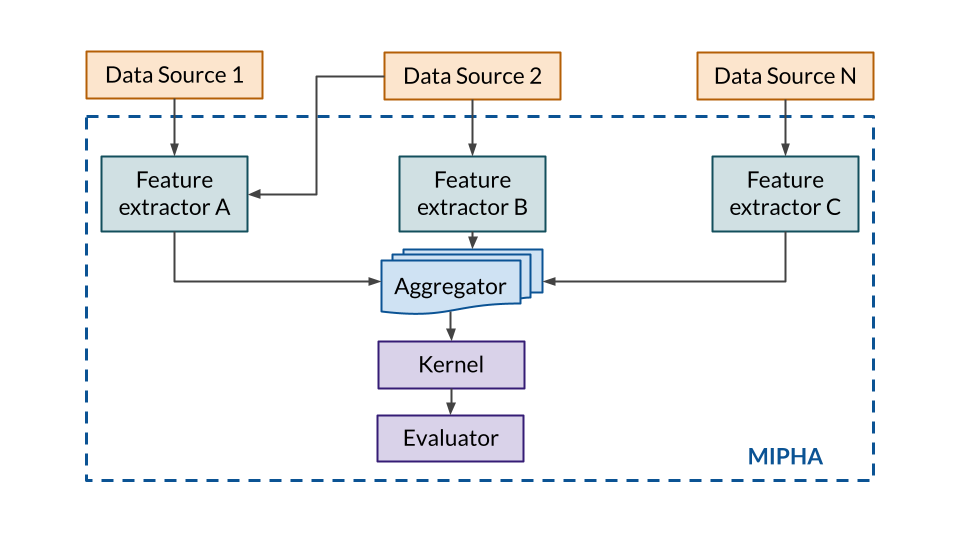

# MIPHA overview
## The MIPHA framework

### General presentation

MIPHA stands for Modular data Integration for Predictive Healthcare Analysis.
It is a Python framework that allows users to create machine learning models, taking into account several data sources.
In other words, people who use the [MIPHA library](https://github.com/SnowHawkeye/mipha) can create their own
implementation
of the MIPHA components to create their own prediction model.

**Why use this prediction framework?**

Its features are as follows:

- [A] Flexible framework allowing for the study of any disease
- [B] Ability to include data from various sources
- [C] Modular architecture designed for reusability

Using the MIPHA framework allows for the easy inclusion or exclusion of data sources when performing predictions. Its
modular architecture allows enables easy reusability of the components.

Finally — and this is the purpose of the associated G1-G2 project — the formalization of this framework allows its
integration into applications and APIs.

### MIPHA components

The following diagram show the components of a MIPHA implementation.

- **Data Sources**: They contain the data processed by the model. They are not technically part of the "model" itself,
  but MIPHA implementations require the data to be formalized as Data Sources in order to function properly. On top of
  the data itself, Data Sources contain a "data type" property, which is used by the Feature Extractors.
- **Feature extractors**: Their role is to use Data Sources to generate features usable by the machine learning model (
  kernel). For example, they can perform feature selection, dimension reduction, vectorization... or nothing at all (and
  give the raw data to the rest of the framework). Each feature extractor specifies which data types it can handle: for
  example, a neural network-based feature extractor may be able to handle the "laboratory" and "electrocardiogram" data
  types. This means that some feature extractors may run on several data sources.
- **Aggregator**: The aggregator collects the data produced by feature extractors and regroups it into a single matrix,
  usable by the kernel. It can be a simple concatenation, or a more complex process involving further processing.
- **Kernel**: The kernel of a MIPHA model is the machine learning model at its core. It performs the prediction using
  the data fed by the aggregator.
- **Evaluator**: It uses the results provided by the Kernel to evaluate its performance.

All of these components are very flexible: there are few constraints on what one can or cannot implement. Again, the
main point of using MIPHA is to clarify and modularize the structure of a model.

## The MIPHA platform

The MIPHA platform is the expected deliverable of the MIPHA G1-G2 project.
The goal is to create an application that allows users of the MIPHA framework to:

- Import and store their data, and get general insights on it.
- Run and evaluate their implementations.
- Store and document both their implementations and the experiments they realized with them.

This platform is complementary to the MIPHA framework: it uses the framework's modularity to its advantage, and allows
users to keep track of their implementations and the performance they obtained with each component.
This should help researchers create reproducible results, and facilitates communication and knowledge transfer.

